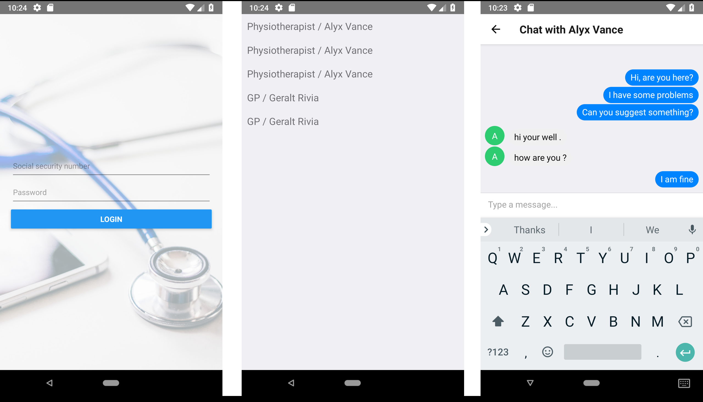

# MedChat: Oulu Health Hack 2018 winning solution

## Project idea
This project is the second winning solution from Open Track @ Oulu Health Hack, June 15-17, 2018.
The main idea of this project was to develop a real-time chat for patient-doctor communication when both of them speak different languages.

## Implementation

### Real-time chat
Firstly, I have developed a patient's mobile app, doctor's interface and the back-end in React Native, ReactJS and Node.JS respectively. For the real-time communication, I used Socket.IO. I used MongoDB as a database.

### Translation micro-service
I trained a baseline for sequence-to-sequence neural machine translation for English-Finnish and Finnish-English and wrapped them in a REST API micro-service using Flask.

### MVP
At the moment I do not have a fully working translation, however, it works to some extend with basic sentences. Furthermore, the project infrastructure is ready and thus simply requires better translation model (big corpus, a lot of waiting time, GPUs and experiments).

#### How to deploy
Coming soon. Installation of all the dependencies is quite complex, so, I would like to check it in a clean Ubuntu environment.

I manage to run everything on a MacBook Pro 2015 and the app still works quite fast and reliable.

Currently, the while thing looks like this:
#### Client (patient's app)

#### Doctor's interface

## Used pictures and icons
* [App background](https://www.pexels.com/photo/silver-iphone-6-near-blue-and-silver-stethoscope-48603/)
* Authors of the icons which I used in my pitching presentation and have to refer to:
  * https://www.flaticon.com/authors/eucalyp
  * https://www.flaticon.com/authors/ddara
  * https://www.flaticon.com/authors/freepik
  * https://www.flaticon.com/authors/smashicons
  * https://www.flaticon.com/authors/twitter
  * https://www.flaticon.com/authors/roundicons
